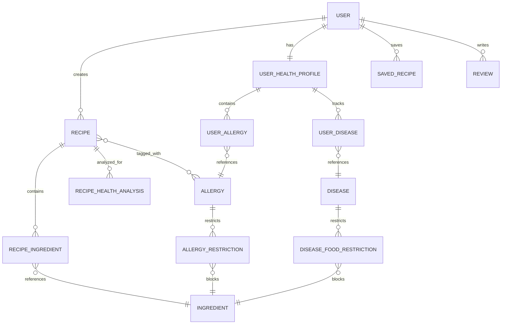

# RecipeHub - AI-Powered Personalized Recipe Platform

RecipeHub is a comprehensive web application designed to provide personalized meal recommendations based on user health profiles, allergies, and dietary preferences. It features a robust recommendation engine that strictly enforces allergen safety while providing tailored health insights for various medical conditions.

## 🚀 Features

- **Personalized Recommendations**: AI-driven engine that scores recipes based on user health data.
- **Strict Allergen Filtering**: Two-layer defense (Tag-based & Keyword-based) to ensure 100% safety for users with allergies.
- **Health Analysis**: Automated scanning of recipe ingredients to identify risks for conditions like Diabetes, Hypertension, and CKD.
- **Meal Planning**: Multi-plan meal planner with calorie tracking and nutritional alignment.
- **Resource Hub**: Categorized health guides, cooking basics, and FAQs personalized for the user.
- **Chef Dashboard**: Specialized interface for chefs to manage recipes and view analytics.

## 🛠️ Technology Stack

### Backend
- **Framework**: Spring Boot 3.x
- **Language**: Java 17
- **Database**: H2 (Development) / SQLite / PostgreSQL (Production ready)
- **Security**: Spring Security with JWT
- **ORM**: Spring Data JPA / Hibernate
- **Validation**: Jakarta Bean Validation (Hibernate Validator)

### Frontend
- **Framework**: Vite + React 18
- **Styling**: Tailwind CSS
- **State Management**: React Context API / Hooks
- **Icons**: Lucide React
- **Animations**: Framer Motion

## 📂 Project Structure

```text
Recipe-plateform/
├── Backend/                 # Spring Boot Source Code
│   ├── src/main/java/com/recipeplatform/
│   │   ├── config/          # Security, Data Seeding, App Config
│   │   ├── controller/      # REST API Endpoints
│   │   ├── domain/          # JPA Entities (Data Model)
│   │   ├── dto/             # Data Transfer Objects
│   │   ├── repository/      # Database Access Layer
│   │   ├── service/         # Business Logic Layer
│   │   └── util/            # Helper Classes (CurrentUser, etc.)
│   └── src/main/resources/  # Application Config & Seed Data (JSON)
├── Frontend/                # Vite + React Source Code
│   ├── src/
│   │   ├── components/      # Reusable UI Components
│   │   ├── pages/           # Page Layouts (Home, Profile, etc.)
│   │   ├── services/        # API Integration
│   │   └── context/         # Auth & Global State
│   └── public/              # Static Assets
└── README.md                # Project Documentation
```

## 📊 Database Schema (ER Diagram)



## 🛡️ Allergen Safety System

RecipeHub implements a high-integrity safety pipeline:
1. **Tag-based Filtering**: Recipes explicitly tagged with an allergen (e.g., "Fish") are instantly excluded.
2. **Keyword Fail-safe**: The engine scans all ingredient names for derivative keywords (e.g., "dashi", "oyster sauce") as a redundant check.
3. **Seafood Cross-Blocking**: Selecting a "Fish" allergy automatically blocks "Shellfish" and "Molluscs" for maximum safety.

## 🛠️ Setup and Installation

### Prerequisites
- JDK 17+
- Node.js 18+
- Maven 3.8+

### Steps
1. **Clone the repository**
2. **Backend Setup**:
   ```bash
   cd Backend
   mvn spring-boot:run
   ```
3. **Frontend Setup**:
   ```bash
   cd Frontend
   npm install
   npm run dev
   ```

## 📜 License
This project is licensed under the MIT License.
